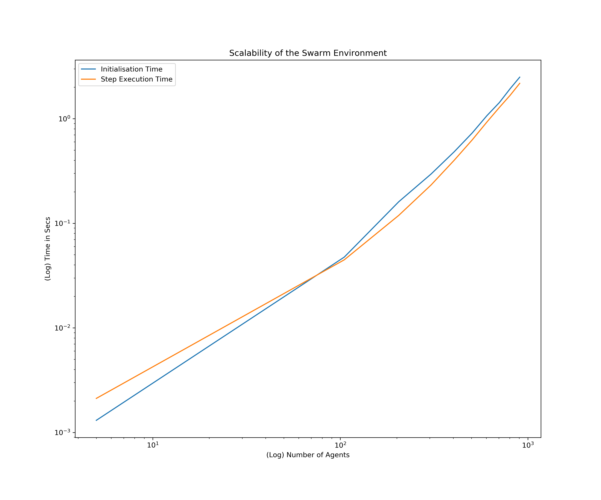

# gym-swarm
## An OpenAI Gym Style Environment for Complex Swarm Behavior
## Author: Robert Tjarko Lange
## Date: February 2018

In this repository we provide a first multi-agent reinforcement learning (MARL) that scales to a large number of agents and allows for efficient proto-typing of large-scale collective behavior. The environment is implemented in the classical OpenAI Gym style and allows for flexible reinforcement signal design.


For a quick start intro view the [notebook](tryout_swarm_env.ipynb).

## Action and State Space

The state space is defined to be a discrete grid of variable size. You can set the size of the grid (see below). Within this grid each agent has access to 8 different actions and can instantaneously move in any direction (l, l-u, l-d, r, r-u, r-d, d, u).

Furthermore, the environment features a predator which initially computes its nearest neighbor (in terms of Chebyshev Distance - due to diagonal movements). This agent is assigned to be the target. Afterwards, the predator continually follows the chosen target. In 10 percent of the transitions the predator computes the nearest neighbor and updates its target.

An episode ends once the predator collides with an agent.

## Reward function


You can set the attraction, repulsion thresholds as well as the predator collision reward. See below. Furthermore, instead of returning a single global reward, you can also return agent-specific rewards by providing a specific *reward_type* dictionary to the *env.step()* function. This will return a dictionary of rewards with each agents credit to the global reward signal. Furthermore, you can specify a curriculum of the different normative reward constituents.

## Scalability of the Environment




## How to use this environment

# Installation

* Clone the repository, install the package.
```
git clone https://github.com/RobertTLange/gym-swarm
cd gym-swarm
pip install -e .
```

* Run the unit tests (if desired).
```
python gym_swarm/tests/test.py
```

# Usage

Go [here](tryout_swarm_env.ipynb)!


# Notes
* Environment is especially suited for prototyping solutions to multi-agent RL problems which require communication.
* Following format guide in https://github.com/openai/gym/tree/master/gym/envs#how-to-create-new-environments-for-gym.
